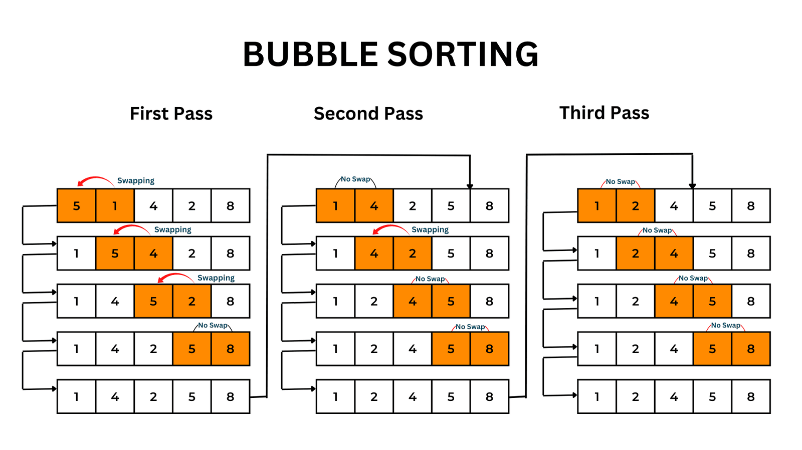

## Bubble sort

- **largest value get push to one side each iteration**

### worst case

-**arrays is in decending order [100,88,56,32,21,1]** -**total operation = n+(n-1)+(n-2)+ 1 = n(n-1)/2 : Big is O(n^2)**

### Best case

-**only few elements are out of order** -**Big O(n)**
