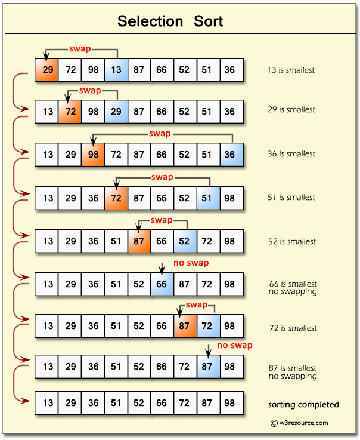

## Selection Sort

- **Find the smallest element in the array and put in the front**

### worst case

- **total operation = n+(n-1)+(n-2)+ 1 = n(n-1)/2 : Big O(n^2)**

### Best case

- **Doesn't matter how array is ordered-Big O(n^2)**

### Sutable for

- **data set that is already mostly sorted**
