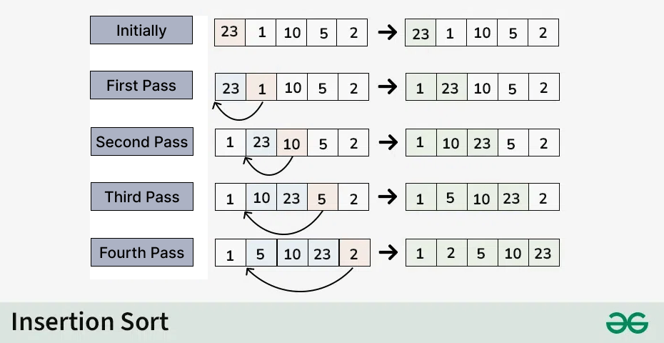

## Insertion Sort

Sort the whole array by sorting the first two elements, then the first three, and so on.

### worst case

- **total operation = 1+ 2 + 3 + ... + (n-1) = n(n-1)/2 : Big O(n^2)**
- **happens when array is sorted in reverse order**

### Best case

- **total operation = n : Big O(n)**
- **happens when array is already sorted**

### Suitable for

- **data set that is already mostly sorted**
